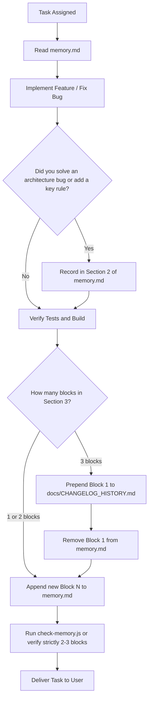

# Universal Agent Memory System (agent-memory)

This skill provides an enterprise-grade, multi-model persistent memory architecture. It separates memory into **Hot Memory** (`memory.md` for active context, strictly capped at 2-3 blocks) and **Cold Memory** (`docs/CHANGELOG_HISTORY.md` for permanent, unedited historical archives).

Compatible out of the box with:
- **Google Antigravity** (`.agents/rules/`, `AGENTS.md`, `GEMINI.md`)
- **Anthropic Claude Code** (`CLAUDE.md`)
- **Cursor IDE** (`.cursorrules`)
- **Windsurf / Cascade** (`.windsurfrules`)
- **OpenAI Codex / ChatGPT / Generic LLMs** (`AGENTS.md`)

---

## 1. Core Principles (The Golden Rules)

1. **Mandatory Start Step:** The agent MUST read `memory.md` before modifying any code.
2. **Architecture Lessons (Section 2):** Any solved bug of architecture, security rule, framework collision, or business constraint MUST be permanently recorded in `## 2. Decisiones de Arquitectura & Parches Críticos`.
3. **Strict 2-3 Active Blocks Limit (Section 3):**
   - Section 3 (`## 3. Bitácora de Sesión Activa`) must NEVER contain more than 3 blocks.
   - When preparing to add Block N and 3 blocks already exist, the agent MUST immediately rotate:
     1. Prepend the oldest block(s) to `docs/CHANGELOG_HISTORY.md` untouched.
     2. Delete those block(s) from `memory.md`.
     3. Append the new Block N to `memory.md`.
4. **Definition of Done (Stop Condition):**
   - A task is NEVER finished until tests pass, the project builds cleanly, and `memory.md` contains strictly between 2 and 3 active blocks.

---

## 2. Workflow Runbook for Agents

### Workflow A: Installing Memory in a New or Existing Project
When asked to "install this skill", "configure memory", or "set up memory.md":

1. **Inspect Target Workspace:**
   - Look for `package.json`, `requirements.txt`, `Cargo.toml`, `go.mod`, etc., to identify the tech stack and project name.
2. **Execute Automated Installer OR Copy Templates:**
   - Option 1 (CLI): Run `node scripts/install-memory.js [target-path]` (pure Node.js, zero dependencies).
   - Option 2 (Manual Copy):
     - Copy `templates/memory.template.md` to `<project-root>/memory.md`.
     - Copy `templates/CHANGELOG_HISTORY.template.md` to `<project-root>/docs/CHANGELOG_HISTORY.md`.
     - Copy `templates/AGENTS.template.md` to `<project-root>/AGENTS.md` and `<project-root>/GEMINI.md`.
     - Copy `templates/CLAUDE.template.md` to `<project-root>/CLAUDE.md`.
     - Copy `templates/cursorrules.template` to `<project-root>/.cursorrules`.
     - Copy `templates/windsurfrules.template` to `<project-root>/.windsurfrules`.
3. **Verify Installation:**
   - Run `node scripts/check-memory.js [target-path]` to confirm health (Exit Code 0).

---

### Workflow B: Routine Task Execution with Memory Hygiene
During day-to-day development in any project equipped with this system:



#### Detailed Steps:
1. **Start of Task:** Read `memory.md`.
2. **Execution:** Code, run unit tests, and build.
3. **If Architecture Bug Resolved:** Update `## 2. Decisiones de Arquitectura & Parches Críticos`.
4. **Drafting the Block:**
   - Format:
     ```markdown
     ### [YYYY-MM-DD] - Bloque N: <Short Descriptive Title>
     - **Requerimiento:**
       - What was requested and root cause.
     - **Implementación Técnica:**
       - Files changed and key logic implemented.
     - **Verificación:**
       - Tests executed, exit codes, and rotation status.
     ```
5. **Enforcing Rotation:**
   - If Section 3 already has 3 blocks:
     - Use `node scripts/rotate-memory.js` OR manually prepend the oldest block to `docs/CHANGELOG_HISTORY.md` at the top, delete it from `memory.md`, and add the new block.
6. **Task Conclusion:** Confirm `memory.md` has strictly between 2 and 3 blocks.

---

## 3. Helper Scripts

Located in the `./scripts/` folder:
- **`install-memory.js`**: Universal project initializer with automatic stack detection.
- **`rotate-memory.js`**: Safe automated block rotation from `memory.md` to `docs/CHANGELOG_HISTORY.md`.
- **`check-memory.js`**: Linter and CI/CD auditor that validates block limits and structure.

---

## 4. Multi-Model Adaptation

For detailed instructions on configuring specific IDEs and models, see:
- [Architecture & Token Optimization Guide](./references/architecture.md)
- [Multi-Model Setup Guide (Claude, Cursor, Windsurf, Antigravity)](./references/multi-model-guide.md)
